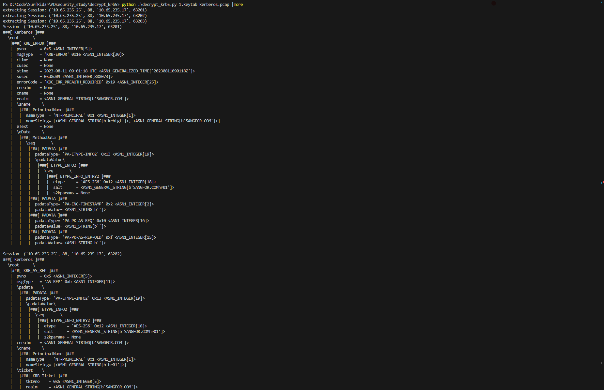

# decrypy_krb5
## 概述
`decrypy_krb5.py`为我在学习 Kerberos 协议为了能够更加了解协议内容写的py脚本。这是一个用于解析Kerberos协议通信的Python脚本,实现了自动提取keytab密钥并解密Kerberos票据的功能，从而便于分析和调试Kerberos认证过程中的数据交互。主要具有以下功能:
- 使用`scapy`库解析pcap文件中的Kerberos数据包
- 自动提取`keytab`文件中的Kerberos密钥
- 对`Kerberos`协议中的加密部分(如`ticket`、`encpart`等)进行解密,并在解密后打印明文票据内容


## 使用

- [x] AS_REQ
- [x] AS_REP
- [x] TGS_REQ
- [x] TGS_REP
- [ ] AP_REQ
- [ ] AP_REP

```python
python .\decrypt_krb5.py 1.keytab kerberos.pcap
```



## 参考链接
- [keytab导出](https://mp.weixin.qq.com/s?__biz=MzIzMTc1MjExOQ==&mid=2247496781&idx=1&sn=4e7218c3b28c2570ff87fbe3c47aef00)
- https://datatracker.ietf.org/doc/html/rfc4120